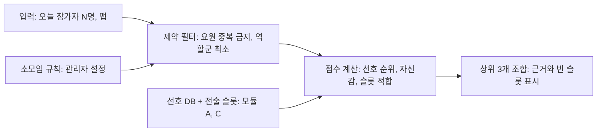

# 발로란트 소모임 사이트 기획서 (Squad Board)

- 상태: 1~4단계 구현 완료 (1단계 PR #1, 2~4단계 2026-10-07). 보류 결정(9절)과 사용 피드백 반영이 남았다
- 작성일: 2026-10-07
- 원본: Claude 기획 문서(아티팩트) → 저장소 md로 이관. 이후 수정은 이 파일이 원천.
- 목업: Claude Design 캔버스 "발로란트 소모임 사이트 목업" (PC 1440×900, 아트보드 4장: 전술 보드 / 스쿼드 편성기 / 멤버 선호 DB / 디자인 토큰)

## 1. 개요와 확정된 전제

이 사이트는 **소모임 전용 전술 보드 + 멤버 선호 DB + 당일 스쿼드 편성기**다. 외부 서비스가 아니라 내부용이며, 1차 목표는 멤버 선호 DB와 편성기만으로 쓸 수 있는 상태다.

| 항목 | 결정 |
| --- | --- |
| 인증 | 공용 패스코드 1개 입력 후 통과. 닉네임 선택으로 본인 식별. 장기 세션 쿠키(90일)로 재인증 최소화 |
| Riot 계정 연동 | 없음 |
| 공개 범위 | 초기엔 내부 사용만. 초대제 불필요 |
| 전술 보드 | 스냅샷 방식. 한 전술 안에 단계(1·2·3) 여러 장 허용. 시간축 애니메이션은 보류 |
| 전술 권한 | 작성자와 관리자만 수정·삭제. 댓글·메모·공동 편집은 추후 확장 |
| 개인 선호 | 본인만 수정, 전원 열람 |
| eDPI | 조준 테스트로 자기 감도를 찾는 도구(브라우저 내 구현) |
| 디자인 | 다크 테마, 발로란트 공식 분위기를 따름 |
| 언어 | 한국어 전용. 문자열은 분리해 두어 추후 다국어 대응 |
| 기기 | PC 기준. 레이아웃은 반응형으로 설계하되 모바일 최적화는 후순위. 별도 앱 없음 |
| 비용 | 무료 티어 기본. 도메인 보유, 미니PC 서버 가능, Vercel 소액 지출 가능 |
| 세션 기록 | 날짜별·스쿼드 구성원별 승패·킬 카운트 등 수기 입력 스냅샷 |
| 기술 스택 (2026-10-07 결정) | Next.js 16 + TypeScript + Tailwind v4 + SQLite(libsql) + Drizzle. 1차 배포는 미정(로컬 실행), 추후 미니PC Docker 또는 Vercel+Turso |

## 2. 모듈 구성과 우선순위

모듈은 6개이고, A·B가 나머지 모든 모듈의 기반이다. 단계 단위로 끊어 개발하면 각 단계가 끝날 때마다 실제로 쓸 수 있는 상태가 된다.

| 모듈 | 포함 기능 | 우선순위 | 의존 | 상태 |
| --- | --- | --- | --- | --- |
| A. 멤버 & 선호 DB | 패스코드 입장, 닉네임 선택, 맵별 선호 요원·포지션 저장·열람 | P0 | 없음 | 완료 |
| B. 맵·요원 마스터 데이터 | 맵 목록·탑뷰 이미지·콜아웃, 요원·역할군·스킬 목록 | P0 | 없음 | 완료 (탑뷰는 자리표시자 SVG, 스킬 4종 입력. 콜아웃 좌표는 미입력) |
| C. 전술 보드 | 맵별 복수 전술, 배치·핑·스킬 위치·동선, 레이어 겹쳐보기 | P1 | A, B | 완료 (시간축 애니메이션·댓글은 보류) |
| D. 스쿼드 편성기 | 당일 참가자 선택 → 조합 추천·분석 | P1 | A, B (C는 선택) | 완료 (전술 슬롯 점수는 3단계 이후) |
| E. 세션 기록 | 날짜별 스쿼드·맵·승패·킬 카운트 수기 입력, 멤버별 조회 | P1 | A, D | 완료 (조합별 조회는 데이터가 쌓인 뒤) |
| F. 유틸 | eDPI 감도 찾기, 외부 사이트 링크 | P2 | 없음 | 완료 |
| G. 리플레이 가져오기 | 리플레이 → 바둑돌 전술지도 | 보류 | 현재 여건 불가(9절 참고) | — |

단계별 목표:

1. **1단계 (A+B)** — 패스코드로 들어가 닉네임을 고르고, 맵별 선호 요원·포지션을 저장한다. 다른 멤버의 선호를 맵 단위로 한 화면에서 본다. ✅
2. **2단계 (D+E)** — 오늘 참가자를 고르면 추천 조합이 나오고, 경기 후 결과를 기록한다. (완료)
3. **3단계 (C)** — 전술 보드. 가장 공수가 크므로 핑·토큰 배치만 있는 최소 버전을 먼저 내고, 동선·단계·겹쳐보기를 덮는다. (완료 — 동선·단계·겹쳐보기·PNG까지 한 번에)
4. **4단계 (F)** — eDPI 도구와 외부 링크. (완료)

사용자가 LLM에 작업을 지시할 때도 이 모듈 단위로 끊어 요청하는 것이 안전하다.

## 3. 데이터 모델

핵심 원칙은 하나다. **전술 안의 요원 토큰은 '슬롯'으로 저장하고, 멤버는 당일 편성 때 바인딩한다.** 멤버가 유동적이므로 "A사이트 연막 담당 전략가"처럼 역할로 저장해야 누가 오든 재사용할 수 있다. 특정 멤버 고정 전술도 허용하되 기본값은 슬롯이다.

| 엔티티 | 필드 | 비고 | 구현 |
| --- | --- | --- | --- |
| Member | id, 닉네임(고유), 표시색, 역할(관리자/일반), 선호 역할군 순위, 메모, dpi, sens, 활성 여부 | 비밀번호 없음. 탈퇴 멤버는 비활성 처리(기록 보존) | `members` |
| Map | id, slug, 이름(한/영), 탑뷰 이미지, 사이트 목록(A/B/C), 콜아웃 좌표 목록, 맵 풀 포함 여부 | 맵 풀 로테이션 대응 | `maps` (콜아웃은 3단계) |
| Agent | id, slug, 이름(한/영), 역할군(타격대/척후대/전략가/감시자), 아이콘, 스킬 4종(이름, 아이콘, 유형) | 스킬 유형 = 연막/섬광/설치형/몰리/정보/이동/치유/궁극기 | `agents` (abilities는 3단계에 채움) |
| MemberMapPreference | member, map, 선호 요원 1~3순위, 공격 포지션, 수비 포지션, 자신감(1~5), 한 줄 메모, 수정일 | 본인만 수정 | `member_map_preferences` |
| Tactic | id, map, 진영(공격/수비), 라운드 유형(피스톨/에코/풀바이/공통), 이름, 태그, 작성자, 생성일, 수정일, 레이어 색조 | 작성자·관리자만 수정·삭제 | `tactics` |
| TacticStage | tactic, 순서, 이름(예: 셋업/실행/플랜트 후), 메모 | 한 전술 안의 스냅샷 여러 장 | `tactic_stages` (최대 8장) |
| TacticObject | stage, 종류, 좌표(맵 기준 0~1 정규화), 회전, 색, 라벨, 메모, 연결 슬롯(선택), 외부 링크(선택) | 종류별 세부 필드는 4절 | `tactic_objects` (경로는 points, 시전 요원·스킬 키, cast↔핑 연결) |
| TacticSlot | tactic, 슬롯 번호(1~5), 요구 역할군 또는 특정 요원, 역할 설명, 고정 멤버(선택) | 편성기가 여기에 멤버를 바인딩 | `tactic_slots` (+ 포지션 힌트). 경기별 바인딩은 `session_match_tactics` |
| Session | id, 날짜, 참가 멤버 목록, 메모 | 하루에 여러 경기 가능 | `sessions` + `session_participants` |
| SessionMatch | session, 순서, map, 결과(승/패/무), 스코어(아군:적군), 사용 전술 목록, 메모 | 수기 입력. 결과는 미입력(null) 허용, 확정 플래그 포함 | `session_matches` + `session_match_tactics` |
| SessionMatchPlayer | match, member, 요원, 포지션, 킬, 데스, 어시스트, 메모 | 멤버별 스냅샷의 단위 | `session_match_players` |

좌표를 0~1로 정규화하는 이유: 맵 이미지 해상도나 화면 크기가 바뀌어도 저장된 전술이 그대로 맞아야 하고, 모바일 대응 시에도 변환이 필요 없다.

## 4. 전술 보드 사양 (3단계)

전술 1개 = 레이어 1장이고, 겹쳐보기는 같은 맵 위에 여러 레이어를 투명도를 달리해 올리는 것이다. 초기에는 정적 스냅샷이며, 디스코드로 대화하며 토큰을 옮기는 용도를 전제로 한다.

### 핑·객체 종류

| 종류 | 표시 | 세부 필드 | 용도 |
| --- | --- | --- | --- |
| 요원 토큰 | 원형 + 요원 아이콘 | 슬롯 번호, 진영 | 배치 위치 |
| 연막 | 반투명 원 | 반경, 시전 요원·스킬 | 연막 떨어지는 위치 |
| 섬광 | 별 모양 | 시전 요원·스킬 | 섬광 터지는 위치 |
| 설치형 | 사각 + 아이콘 | 시전 요원·스킬 | 트랩·와이어·알람봇 |
| 몰리 | 불꽃 아이콘 원 | 반경, 시전 요원·스킬 | 포스트 플랜트 라인업 등 |
| 정보 스킬 | 부채꼴 범위 | 각도, 시전 요원·스킬 | 리콘·드론 시작점과 방향 |
| 스킬 시전 위치 | 작은 마름모 | 연결된 핑 | "여기서 던지면 저기에 떨어짐" |
| 중요 거점 | 별표 핑 | 라벨 | 컨트롤 포인트 |
| 위험 지점 | 경고 삼각형 | 라벨 | 자주 맞는 각 |
| 자유 메모 | 말풍선 | 텍스트 | 기타 |
| 아군 이동 경로 | 실선 화살표 | 점 목록, 연결 슬롯 | 러시·로테이션 |
| 상대 예상 동선 | 점선 화살표(적군 색) | 점 목록 | 예측 |
| 상대 실제 동선 | 실선 화살표(적군 색) | 점 목록 | 경기 후 복기 |
| 타이밍 라벨 | 작은 배지 | 텍스트(예: 0:15) | 시간축 없이 순서 표기 |

스킬 위치 핑은 요원 토큰과 분리된 독립 객체로 두고, 어느 요원의 스킬인지 연결선으로 묶는다. 그래야 핑 단위로 외부 라인업 링크를 붙일 수 있다.

### 동작

- 맵 선택 → 전술 목록(진영·라운드 유형·태그로 필터) → 전술 열기
- 편집: 좌측 팔레트에서 객체 종류를 고르고 맵 위에 클릭(핑) 또는 드래그(경로). 객체 클릭 시 우측에 속성 패널
- 단계: 상단 탭으로 단계 1·2·3 전환. 새 단계는 이전 단계를 복사해 시작
- 겹쳐보기: 전술 목록에서 여러 개를 체크하면 각 전술의 고유 색조로 동시 표시. 투명도 슬라이더
- 확대·이동: 휠로 확대, 스페이스+드래그로 이동
- 저장: 명시적 저장 버튼 + 자동 임시 저장
- 내보내기: 현재 보이는 상태를 PNG로 저장(디스코드 공유용)

### 권한

| 행위 | 작성자 | 관리자 | 그 외 멤버 |
| --- | --- | --- | --- |
| 열람 | O | O | O |
| 수정·삭제 | O | O | X |
| 복제(내 전술로) | O | O | O |
| 댓글·메모 | 추후 | 추후 | 추후 |

복제를 처음부터 허용하면 공동 편집 없이도 "내 버전으로 고쳐보기"가 가능하다.

### 구현 메모 (2026-10-07, 3단계)

- 보드는 SVG(viewBox 1000×1000)이고 확대·이동은 안쪽 `<g transform>`으로 처리한다. 저장은 0~1 정규화 좌표. 편집기·겹쳐보기·PNG 내보내기가 같은 렌더러(`src/components/tactic-board/board-svg.tsx`)를 쓴다.
- 저장 단위는 "단계의 객체 목록 통째 교체"(`saveStageAction`). 자동 임시 저장(2.5초 디바운스)과 Ctrl+S·저장 버튼. 마지막 저장이 이기는 전제 그대로.
- 경로는 클릭마다 점 추가 → 더블클릭/Enter 완성. 드래그 이동은 선택 도구에서. 경로형 객체는 얇아서 거리 판정으로 선택한다.
- 맵 탑뷰는 `public/maps/<slug>.svg` 자리표시자(사이트 배치만 표시)다. 실제 이미지로 바꾸려면 같은 이름의 파일로 교체하거나 `maps.image_path`를 바꾼다. 시드는 `image_path`가 비어 있을 때만 채운다.
- 요원 스킬 4종은 `src/db/seed-data.ts`에 수기 입력했다(Veto는 미확인으로 비움). 스킬 핑의 시전 요원·스킬 선택지는 그 종류(연막/섬광/...)와 궁극기만 보여준다.
- 겹쳐보기는 전술마다 단계를 고를 수 있고, 첫 레이어를 제외한 레이어에 투명도 슬라이더(기본 0.55)가 적용된다.
- PNG 내보내기는 배경 이미지를 data URL로 인라인한 뒤 캔버스에 그린다. 글꼴은 시스템 대체가 일어날 수 있다.
- 시간축 애니메이션·댓글·공동 편집은 기획서대로 보류했다.

## 5. 스쿼드 편성기 로직 (2단계)

편성기는 결과를 강제하지 않고 근거를 보여주는 보조 도구다. 처음엔 규칙 기반 점수로 충분하고, 세션 기록이 쌓이면 승패를 반영하도록 확장한다.

제약을 먼저 걸러 후보를 줄이고, 남은 조합에 점수를 매겨 상위 3개를 근거와 함께 보여준다.

### 제약 (관리자 설정)

- 한 조합 안에 같은 요원 중복 불가
- 역할군 최소 구성: 기본값은 전략가 1 이상, 척후대 1 이상. 소모임 규칙으로 조정
- 참가자가 5명 초과면 로테이션 안 제시, 5명 미만이면 빈 슬롯을 그대로 표시

### 점수

| 항목 | 점수 | 출처 |
| --- | --- | --- |
| 해당 맵 선호 요원 1순위 | +3 | MemberMapPreference |
| 2순위 / 3순위 | +2 / +1 | MemberMapPreference |
| 자신감(1~5) | +0~+2 | MemberMapPreference |
| 선택한 전술의 슬롯과 역할군 일치 | +2 (슬롯당) | TacticSlot (3단계 이후) |
| 선호 포지션이 전술 배치와 일치 | +1 | MemberMapPreference, TacticObject (3단계 이후) |
| 최근 세션에서 같은 요원으로 승리 | +1 (추후) | SessionMatchPlayer |

### 출력

- 상위 2~3개 조합. 각 조합마다 멤버 → 요원 → 포지션
- 근거: "이 조합이면 전술 X, Y 그대로 실행 가능 / Z는 연막 담당이 비어 수정 필요"
- 확정 버튼을 누르면 Session에 기록되고 전술 슬롯에 멤버가 바인딩된다
- 수동 조정 허용: 드래그로 요원을 바꾸면 점수와 근거가 다시 계산된다

### 구현 메모 (2026-10-07, 2단계)

- 로직은 `src/lib/squad/compose.ts` 순수 함수(`composeSquads`, `evaluateAssignment`)이고 `npm test`로 단위 테스트한다. 서버 액션과 화면이 같은 함수를 쓰므로 수동 조정 시 재계산도 같은 기준이다.
- 제약은 상수(`DEFAULT_RULES`: 전략가 1·척후대 1 이상)로 시작했다. 관리자 설정 화면은 후순위.
- 참가자 상한 10명(`MAX_PARTICIPANTS`). 5명 초과면 5인 조합마다 벤치가 다른 로테이션 안을 상위 3개 제시한다.
- 규칙을 만족하는 배정이 없으면 빈 결과 대신 최고 점수 배정을 "규칙 미달" 경고와 함께 보여준다.
- 수동 조정은 드래그 대신 요원 선택 상자로 구현했다(PC 기준, 구현 단순). 선호 밖 요원은 0점으로 채점된다.

## 6. 세션 기록 (2단계)

기록 단위는 "날짜 → 경기 → 멤버" 3단이고, 모두 수기 입력이다. 입력 부담을 줄이기 위해 편성기에서 확정한 조합이 경기 기록의 초기값으로 들어간다.

### 입력 흐름

1. 세션 생성: 날짜, 참가자 체크(편성기에서 자동 생성 가능)
2. 경기 추가: 맵, 결과(승/패/무), 스코어(예: 13:9), 사용한 전술 선택(선택)
3. 멤버별 행: 요원·포지션은 편성 결과로 미리 채워지고, 킬·데스·어시스트는 선택 입력
4. 스냅샷 확정: 확정 후에는 관리자만 수정

### 조회 화면

| 화면 | 보여주는 것 |
| --- | --- |
| 날짜별 | 그날 경기 목록, 맵별 승패, 참가자 조합 |
| 멤버별 | 참가 횟수, 맵별 승률, 자주 쓴 요원, 최근 10경기 |
| 맵별 | 승률, 자주 쓴 전술과 그 전술의 승률 |
| 조합별 | 같은 5명 조합으로 치른 경기의 승률 |

스냅샷은 당시 선호·전술을 복사해 보관한다. 이후 선호를 바꾸거나 전술을 수정해도 과거 기록은 변하지 않는다.

### 구현 메모 (2026-10-07, 2단계)

- 화면: `/squad`(편성) → `/sessions/[id]`(경기 입력) → `/sessions`(날짜별) · `/sessions/stats`(멤버별·맵별). 조합별 조회는 데이터가 쌓인 뒤 추가한다.
- 권한: 세션·경기 생성과 미확정 경기 수정·확정은 모든 멤버, 확정된 경기 수정·확정 해제와 세션 삭제는 관리자.
- 편성기 없이 "오늘 모였다"만 먼저 적을 수 있도록 수동 세션 생성 폼을 두었다. 경기 추가 시 출전 멤버(최대 5명)의 요원·포지션은 그 맵 선호로 편성기를 한 번 돌려 미리 채운다.
- 통계는 결과가 입력된 경기만 세고, 승률은 승 / (승+패)로 무승부를 분모에서 뺀다. 확정은 수정 잠금일 뿐 집계 조건이 아니다.

## 7. eDPI 영점조절과 외부 유틸 (4단계)

조준 테스트로 감도를 찾는 도구는 브라우저에서 구현 가능하다. 레퍼런스로 든 Easy Lineup·Valoplant·Valoline 세 사이트에는 이 기능이 없고, 비슷한 도구는 3D Aim Trainer Sensitivity Finder, Aim Lab, SteelSeries Sensitivity Tools에 있다.

### 브라우저 구현 방식

1. 사용자가 마우스 DPI를 입력한다. 브라우저는 DPI를 읽을 수 없고 마우스 이동량만 받는다 (1단계에서 DPI·sens 입력은 구현됨)
2. Pointer Lock으로 커서를 숨기고 원시 이동량을 받아 캔버스 위에서 조준점을 움직인다
3. 테스트 2종: 플릭(나타난 표적을 빠르게 클릭)과 트래킹(움직이는 표적을 따라감)
4. 감도를 두 값으로 번갈아 테스트해 더 나은 쪽으로 범위를 좁혀간다(이분 탐색, 5~6회)
5. 결과를 eDPI와 발로란트 감도(eDPI ÷ DPI)로 표시하고 멤버 프로필에 저장한다

발로란트는 360도 회전에 필요한 이동량이 eDPI에 반비례하므로, 캔버스 위 조준점 이동을 같은 비율로 맞추면 게임 감각에 가깝게 만들 수 있다. 단, 시야각과 3D 투영이 없어 완전한 재현은 아니며, "내 감도 범위를 좁히는 도구"로 위치시킨다.

### 함께 넣을 간단 기능

- eDPI 계산기: DPI × 감도 ✅
- 멤버 감도 비교표: 멤버별 DPI, 감도, eDPI를 한 표에 (관리 화면에 일부 표시)
- 크로스헤어 코드 공유: 멤버 프로필에 문자열 저장 + 복사 버튼

### 외부 유틸 연결

| 사이트 | 역할 | 연결 방식 |
| --- | --- | --- |
| Easy Lineup | 스킬 라인업 영상·스크린샷 모음 | 전술 보드의 스킬 핑에 링크 필드. 맵 페이지에 바로가기 |
| Valoline | 라인업 모음 | 위와 동일 |
| Valoplant | 전술 보드 | 이 사이트의 전술 보드가 대체. 기존 Valoplant 전술은 링크로 첨부 |

기능 복제는 하지 않는다. 라인업 사이트는 수백 개의 영상 콘텐츠가 본체이고 저작권·약관 문제가 있다.

### 구현 메모 (2026-10-07, 4단계)

- `/tools`: 감도 찾기(`sens-finder.tsx`), 내 감도·eDPI(1단계 폼 재사용), 크로스헤어 코드 저장·복사, 멤버 감도 비교표(DPI·감도·eDPI·360° cm·코드), 외부 사이트 카드.
- 감도 찾기는 라운드마다 후보 A(구간 1/3)·B(2/3)를 번갈아 테스트하고 더 나은 쪽으로 구간을 좁힌다(5라운드). 점수 = 플릭(초당 명중, 미스 감점) 50% + 트래킹(표적 위 시간 비율) 50%. 계산식은 `src/lib/tools/sens.ts`에 두고 단위 테스트한다.
- 마우스 1카운트 = 0.07° × 감도(발로란트 yaw), 캔버스 폭 = 시야각 103°로 대응시킨다. 3D 투영이 없어 "범위를 좁히는 도구"로 안내한다.
- 외부 사이트는 URL 패턴 변동을 피해 홈 링크만 둔다. 보드의 스킬 핑·시전 위치 객체에 외부 링크 필드가 있다.

## 8. 디자인 토큰

다크 테마 단일이며, 발로란트의 네이비·레드·오프화이트 분위기를 따른다. 가장 중요한 토큰은 전술 보드 위에 어두운 맵 이미지를 배경으로 올라가는 의미 색이다. 실제 값은 `src/app/globals.css`의 CSS 변수가 원천이며, 아래는 그 요약이다.

### 표면·글자 색

| 토큰 | 값 | 용도 |
| --- | --- | --- |
| --bg-base | #0F1923 | 페이지 배경 |
| --bg-surface | #1A2733 | 카드, 패널 |
| --bg-raised | #22303D | 호버, 드롭다운, 모달 |
| --bg-canvas | #0A1017 | 전술 보드 캔버스 바닥 |
| --border | #2F3E4C | 기본 테두리 |
| --border-strong | #4A5A69 | 포커스, 구분선 강조 |
| --text-primary | #ECE8E1 | 본문 |
| --text-secondary | #9DA6AE | 보조 텍스트, 라벨 |
| --text-muted | #5F6B76 | 비활성, 플레이스홀더 |
| --accent | #FF4655 | 주요 버튼, 활성 탭, 포인트 |
| --accent-hover | #FF6B77 | 호버 |
| --accent-subtle | rgba(255,70,85,0.14) | 선택 배경 |

### 상태 색

| 토큰 | 값 | 용도 |
| --- | --- | --- |
| --success | #3DDC97 | 저장 완료, 승리 |
| --warning | #FFC857 | 빈 슬롯, 주의 |
| --danger | #FF4655 | 삭제, 패배 (accent와 공유) |
| --info | #5AC8FA | 안내 |

### 의미 색 — 진영·역할군

아군·적군은 청록·주황으로 두어 적록 색약에도 구분되게 한다. 공격·수비는 색보다 라벨·아이콘으로 구분하고 색은 보조로만 쓴다.

| 토큰 | 값 | 용도 |
| --- | --- | --- |
| --ally | #2EE6D6 | 아군 토큰, 아군 경로 |
| --enemy | #FF8A3D | 적군 토큰, 적 동선 |
| --side-attack | #FF4655 | 공격 배지 |
| --side-defense | #5AC8FA | 수비 배지 |
| --role-duelist | #FF5C5C | 타격대 |
| --role-initiator | #FFB454 | 척후대 |
| --role-controller | #7B8CFF | 전략가 |
| --role-sentinel | #4FD98A | 감시자 |

### 의미 색 — 핑·경로

| 토큰 | 값 | 선 스타일 | 용도 |
| --- | --- | --- | --- |
| --ping-smoke | rgba(170,190,210,0.45) | 채운 원 | 연막 |
| --ping-flash | #FFF07A | 별 | 섬광 |
| --ping-trap | #C77DFF | 사각 | 설치형 |
| --ping-molly | #FF7A2E | 원 + 불꽃 | 몰리 |
| --ping-recon | #5AC8FA | 부채꼴 | 정보 스킬 |
| --ping-cast | #ECE8E1 | 작은 마름모 | 스킬 시전 위치 |
| --ping-objective | #FFC857 | 별표 | 중요 거점 |
| --ping-danger | #FF4655 | 삼각형 | 위험 지점 |
| --ping-note | #9DA6AE | 말풍선 | 자유 메모 |
| --path-ally | --ally | 실선 2px, 화살표 | 아군 이동 |
| --path-enemy-expected | --enemy | 점선 2px (6 4), 화살표 | 상대 예상 동선 |
| --path-enemy-actual | --enemy | 실선 2px, 화살표 | 상대 실제 동선 |

### 레이어 색조 (겹쳐보기용)

전술마다 아래 8색 중 하나를 생성 시 자동 배정한다. 겹쳐보기 시 각 전술의 객체 테두리와 경로가 이 색으로 바뀐다.

`--layer-1` #FF4655 · `--layer-2` #2EE6D6 · `--layer-3` #FFC857 · `--layer-4` #7B8CFF · `--layer-5` #4FD98A · `--layer-6` #FF8A3D · `--layer-7` #C77DFF · `--layer-8` #ECE8E1

### 타이포그래피

| 토큰 | 값 | 용도 |
| --- | --- | --- |
| --font-body | Pretendard, system-ui, sans-serif | 본문, UI 전반 (한글) |
| --font-display | "Barlow Condensed", "Pretendard", sans-serif | 제목, 맵·요원 이름, 공식 느낌의 컨덴스드 영문 |
| --font-mono | "JetBrains Mono", ui-monospace, monospace | 타이밍, 스코어, eDPI, 크로스헤어 코드 |
| --text-xs | 12px / 16px | 배지, 핑 라벨 |
| --text-sm | 14px / 20px | 보조 텍스트, 표 |
| --text-base | 16px / 24px | 본문 |
| --text-lg | 18px / 28px | 카드 제목 |
| --text-xl | 24px / 32px | 섹션 제목 (display) |
| --text-2xl | 32px / 40px | 페이지 제목 (display, 대문자) |

본문 한글은 Pretendard로 통일하고, 제목과 고유명사(맵·요원 영문명)에만 컨덴스드 서체를 써서 공식 분위기를 낸다. 공식 전용 서체·로고는 쓰지 않는다. 폰트는 npm 패키지로 로드해 외부 네트워크 의존이 없다.

### 간격·반경·그림자

| 토큰 | 값 |
| --- | --- |
| --space-1 ~ --space-8 | 4, 8, 12, 16, 24, 32, 48, 64px |
| --radius-sm | 2px (버튼, 배지 — 각진 인상) |
| --radius-md | 4px (카드, 입력) |
| --radius-full | 9999px (요원 토큰, 아바타) |
| --shadow-sm | 0 1px 2px rgba(0,0,0,0.4) |
| --shadow-md | 0 4px 12px rgba(0,0,0,0.5) |
| --shadow-glow | 0 0 0 2px var(--accent-subtle) (선택 객체) |

반경을 작게 잡는 이유: 발로란트 UI는 날카로운 사각이 기본이다. 둥근 모서리는 토큰과 아바타에만 쓴다.

### 전술 보드 전용 치수

| 토큰 | 값 |
| --- | --- |
| --token-size | 28px (요원 토큰 지름, 줌드럼 배율 적용) |
| --ping-size | 20px |
| --path-width | 2px |
| --layer-opacity-active | 1.0 |
| --layer-opacity-overlay | 0.55 (겹쳐보기 기본값, 슬라이더로 조절) |
| --map-min-width | 720px (PC 기준 보드 최소 폭) |

## 9. 현실성 체크와 미결 사항

리플레이 가져오기는 현재 여건으로 불가능하고, 나머지는 모두 구현 가능하다.

| 항목 | 판단 | 근거·대안 |
| --- | --- | --- |
| 리플레이 파일 파싱 | 불가 | 2026년 현재 클라이언트 리플레이는 내보내기가 없고 PC 로컬에만 저장되며 패치마다 만료된다 ([Turbosmurfs 정리](https://turbosmurfs.gg/article/valorant-replay-system)). 수기 작성이 기본 |
| Riot 공식 API로 경기 데이터 | 보류 | VAL-MATCH-V1으로 킬 위치·플랜트 위치 등 이벤트 단위는 가능하나 연속 이동 경로는 없고, 프로덕션 키 승인이 필요. Riot 계정 연동도 필요해져 초기 전제와 충돌 |
| Riot 에셋(맵 탑뷰, 요원 아이콘) | 가능 | 비상업 팬 프로젝트 범위. 공식 로고·전용 서체는 사용하지 않음 |
| 패스코드 인증 | 가능 | 유출 시 관리자가 코드를 바꾸면 전원 재입력. 닉네임 도용은 내부 신뢰로 감수 |
| 여러 명 동시 편집 | 보류 | 전술은 작성자만 수정하므로 충돌이 드물다. 마지막 저장이 이기는 방식으로 시작 |

### 보류한 결정 (사용 후 피드백으로)

- [ ] 전술 보드 시간축 애니메이션 도입 여부
- [ ] 전술 댓글·메모 및 공동 편집 권한
- [ ] 편성기에 세션 승패 반영
- [ ] 다국어 지원
- [ ] 모바일 전술 보드 편집(조회는 처음부터 반응형)

### 다음 단계

- [x] 구조·구현 방법 결정 → Next.js + SQLite, 로컬 실행 우선 (2026-10-07)
- [x] 맵·요원 마스터 데이터 초기 입력 → `src/db/seed-data.ts` 수기 유지
- [x] 1단계(A+B) 구현 → PR #1
- [x] 2단계(D+E): 스쿼드 편성기 + 세션 기록 (2026-10-07)
- [x] 3단계(C): 전술 보드 — 핑·토큰·경로·단계·겹쳐보기·PNG·슬롯, 편성기·세션 연동 (2026-10-07)
- [x] 4단계(F): 감도 찾기·크로스헤어·감도 비교표·외부 링크 (2026-10-07)
- [ ] 맵 탑뷰 이미지를 자리표시자 SVG에서 실제 이미지로 교체 (`public/maps/<slug>.svg` 또는 `maps.image_path`)
- [ ] 요원 Veto 스킬 명칭 입력 (`src/db/seed-data.ts`)
- [ ] 배포 방식 결정 (미니PC Docker vs Vercel+Turso)
